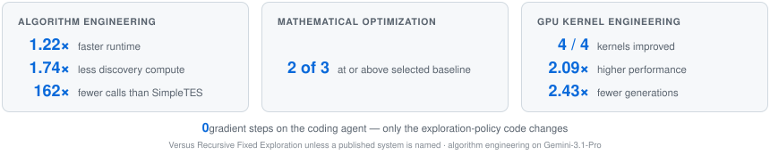
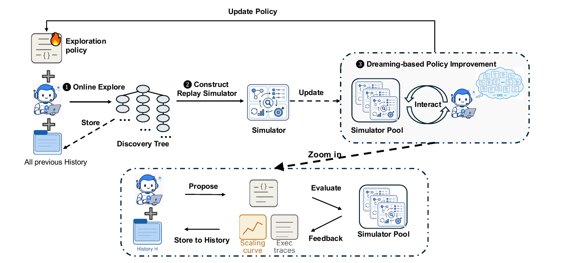

<div align="center">

<p>
  
  &nbsp;&nbsp;&nbsp;&nbsp;&nbsp;&nbsp;
  <picture>
    <source media="(prefers-color-scheme: dark)" srcset="assets/logos/google-deepmind-dark.svg">
    
  </picture>
  &nbsp;&nbsp;&nbsp;&nbsp;&nbsp;&nbsp;
  <picture>
    <source media="(prefers-color-scheme: dark)" srcset="assets/logos/umd-dark.svg">
    
  </picture>
  &nbsp;&nbsp;&nbsp;&nbsp;&nbsp;&nbsp;
  <picture>
    <source media="(prefers-color-scheme: dark)" srcset="assets/logos/uva-dark.svg">
    
  </picture>
</p>

# Dream-RSI: Recursive Self-Improvement<br>through Evolving Worlds

**Agents need dreams for recursive self-improvement — and their own history is already the simulator to dream in.**

[](https://www.dream-rsi.com/assets/dream-rsi.pdf)
[](https://www.dream-rsi.com)
[](https://www.dream-rsi.com)
[](https://www.dream-rsi.com/assets/dream-rsi.pdf)

Tong Zheng<sup>1,2</sup>,
Xidong Wu<sup>1✉</sup>,
Zheng Zhang<sup>1✉</sup>,
Zhankui He<sup>3</sup>,
Chaoyi Zhang<sup>1</sup>,
Benjamin Coleman<sup>3</sup>,
Ruoqiao Wei<sup>1</sup>,
Di Bai<sup>3</sup>,
Haolin Liu<sup>4</sup>,
Rui Liu<sup>2</sup>,
Xue Wang<sup>1</sup>,
Yue Zhuan<sup>1</sup>,
Wang-Cheng Kang<sup>3</sup>,
Renkai Xiang<sup>1</sup>,
Heng Huang<sup>2</sup>,
Xinwu Cheng<sup>1</sup>,
Yunsong Guo<sup>1</sup>

<sup>1</sup>Google &nbsp;·&nbsp;
<sup>2</sup>University of Maryland, College Park &nbsp;·&nbsp;
<sup>3</sup>Google DeepMind &nbsp;·&nbsp;
<sup>4</sup>University of Virginia

<sup>✉</sup> Corresponding authors

</div>

---

> [!NOTE]
> Code is being prepared for release. See [Release plan](#release-plan).

<p align="center">
  <picture>
    <source media="(prefers-color-scheme: dark)" srcset="assets/stats-dark.svg">
    
  </picture>
</p>

## News

- **Sep 2026** — Preprint and project page released:
  [paper (PDF)](https://www.dream-rsi.com/assets/dream-rsi.pdf) ·
  [dream-rsi.com](https://www.dream-rsi.com)

## Overview

**Progress in recursive self-improvement hinges on effective exploration.** As self-improvement
targets get harder, discovery stretches over thousands of proposal–evaluation cycles, and poor
exploration wastes substantial computation on ineffective search directions. Managing and improving
the exploration strategy is the bottleneck, and current systems face a dilemma: fixed strategies
cannot adapt as search spaces scale, while optimizing the policy online means navigating a vast
meta-search space under delayed and expensive feedback — assessing one exploration policy requires
observing how it shapes an entire discovery process.

**Our key insight is that accumulated discovery history can serve as a replay simulator over the
realized search space.** A completed discovery process already records a structured tree of past
exploration decisions and their realized code-execution outcomes. An alternative policy can traverse
that tree differently: different subsets of recorded branches, in different orders, with different
parallel groupings and stopping decisions. Because all outcomes are already saved, evaluating it
requires only reading past records — no rerunning of the discovery agent or the evaluator. By analogy
with model-based RL and world models, the history becomes a world the agent can *dream* in.

**Dream-RSI closes a self-improvement loop at the exploration layer.** A lightweight orchestration
layer makes exploration explicit and programmable — branching, parallel exploration, stopping —
while leaving the underlying coding agent unchanged. ❶ the current policy drives online discovery
and logs its traces; ❷ the recorded trees are converted into a reusable simulator pool; ❸ candidate
policies are evaluated and refined by dreaming over that pool, which returns immediate, low-cost
off-policy feedback. The improved policy is redeployed online, continuously expanding the pool.

<p align="center">
  <picture>
    <source media="(prefers-color-scheme: dark)" srcset="assets/fig1-overview-dark.png">
    
  </picture>
</p>

**[Method, results and interactive walkthrough → dream-rsi.com](https://www.dream-rsi.com)**

## Highlights

- **Dreaming is free.** Scoring a policy against the record costs no discovery agent, no evaluator
  and no re-execution — only a traversal of outcomes that were already paid for.
- **What improves is code, not weights.** The exploration policy is an executable program deciding
  where to search, what runs in parallel and when to stop. The coding agent is never touched.
- **Improvement is monotone by construction.** The incumbent policy is always one of the candidates,
  so a round can only replace it with something that scores better on the accumulated history.

## Release plan

| Item | Status |
|---|---|
| Paper (PDF) | ✅ Available |
| Project page & interactive demo | ✅ [dream-rsi.com](https://www.dream-rsi.com) |
| arXiv posting | 🔜 In progress |
| Discovered programs | ⏳ Being prepared |
| Full codebase | ⏳ Being prepared |
| Reproduction scripts | ⏳ Being prepared |

## Citation

```bibtex
@article{zheng2026dreamrsi,
  title   = {Dream-RSI: Recursive Self-Improvement through Evolving Worlds},
  author  = {Zheng, Tong and Wu, Xidong and Zhang, Zheng and He, Zhankui and
             Zhang, Chaoyi and Coleman, Benjamin and Wei, Ruoqiao and Bai, Di and
             Liu, Haolin and Liu, Rui and Wang, Xue and Zhuan, Yue and
             Kang, Wang-Cheng and Xiang, Renkai and Huang, Heng and
             Cheng, Xinwu and Guo, Yunsong},
  journal = {arXiv preprint arXiv:XXXX.XXXXX},
  year    = {2026}
}
```
